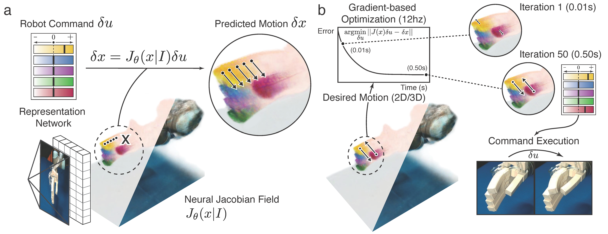

# Neural Jacobian Field

This is the code for **Unifying 3D Representation and Control of Diverse Robots with a Single Camera** by Sizhe Lester Li, Annan Zhang, Boyuan Chen, Hanna Matusik, Chao Liu, Daniela Rus, and Vincent Sitzmann

Check out the [project website here](https://sizhe-li.github.io/publication/neural_jacobian_field/).



## News
- [12/03/2024] We will release a cleaner, type-checked implementation in two weeks. Stay tuned!


## Installation

```bash
conda create --name neural-jacobian-field python=3.9.18
conda activate neural-jacobian-field

cd project
bash install.sh
python3 -m pip install -e .
```

## Acquiring Datasets

Neural Jacobian Fields was trained with our own multi-view robot dataset. Our dataset includes a pneumatic robot hand (mounted on a robot arm), the Allegro robot hand, the Handed Shearing Auxetics platform, and the Poppy robot arm.

We plan to release all our robot data to encourage future research endeavors.

**(09/20/2024) We are actively working on uploading our dataset to the web. Updates on this coming very soon!** Feel free to contact sizheli@mit.edu if you need the dataset urgently.

## Acquiring Pre-trained Checkpoints

You can find pre-trained checkpoints [here](https://drive.google.com/drive/folders/1fq0nngkeRWhCJ_CAyzQopYda20Zu-Zu8?usp=sharing). Directory `model_checkpoints` needs to be placed in the root directory for inference examples (.ipynb files) to run correctly.

## Running the Code

### Training

The main entry point is `project/neural_jacobian_field/train.py`. Call it via:

```bash
python3 -m neural_jacobian_field.train \
training.data.batch_size=6 training.data.num_workers=16 dataset=toy_arm \
model=toy_arm model.train_flow=false model.train_encoder=true
```

To reduce memory usage, you can change the batch size as follows:

```bash
python3 -m neural_jacobian_field.train training.data.batch_size=1 "...all other flags"
```

Our code supports multi-GPU training. The above batch size is the per-GPU batch size.

### Evaluation

- [Visualize Jacobian Fields] `notebooks/1_visualize_jacobian_fields.ipynb`
- [Inverse Dynamics Optimization] `notebooks/2_inverse_dynamics_optimization.ipynb`
- [Robot Experiment] `Coming soon!`

## Camera Conventions

Our extrinsics are OpenCV-style camera-to-world matrices. This means that +Z is the camera look vector, +X is the camera right vector, and -Y is the camera up vector. Our intrinsics are normalized, meaning that the first row is divided by image width, and the second row is divided by image height.


## BibTeX

```
@misc{li2024unifying3drepresentationcontrol,
      title={Unifying 3D Representation and Control of Diverse Robots with a Single Camera}, 
      author={Sizhe Lester Li and Annan Zhang and Boyuan Chen and Hanna Matusik and Chao Liu and Daniela Rus and Vincent Sitzmann},
      year={2024},
      eprint={2407.08722},
      archivePrefix={arXiv},
      primaryClass={cs.RO},
      url={https://arxiv.org/abs/2407.08722}, 
}
```

## Acknowledgements

The authors thank Hyung Ju Terry Suh for his writing suggestions (system dynamics) and Tao Chen and Pulkit Agrawal for their hardware support on the Allegro hand.
V.S. acknowledges support from the Solomon Buchsbaum Research Fund through MIT’s Research Suppport Committee. 
S.L.L. was supported through an MIT Presidential Fellowship. 
A.Z., H.M., C.L., and D.R. acknowledge support from the National Science Foundation EFRI grant 1830901 and the Gwangju Institute of Science and Technology.
